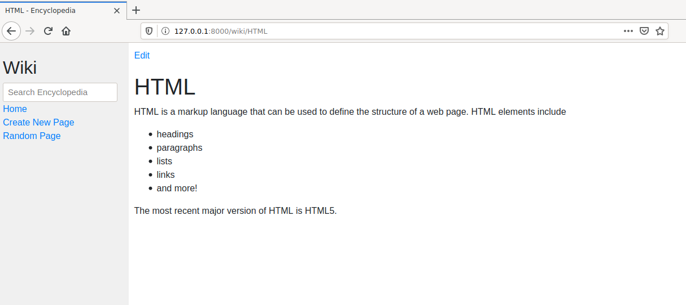

# Wiki

Wikipedia-like online encyclopedia using [Django framework](https://www.djangoproject.com/).

Encyclopedia entries are stored on `entries` folder.
They are written using a markup language called [Markdown](https://www.markdownguide.org/getting-started/).

## Functionalities

- View encyclopedia pages: Visiting `/wiki/TITLE` will render content of `TITLE` page 
  (Markdown is rendered into HTML) 
- Index page: Shows a list of all pages in the encyclopedia. Click on any entry to be taken to that page.
- Search: Can type queries into the search box in the sidebar
    - If query does match the name of an entry, it will redirect to that entry page.
    - If query does not match, it will show a list of similar results.
- Create a new page: Click on "Create New Page" link or visiting `wiki/create`. 
  We can set the title and content of the new page and save it. 
- Edit an entry: "Edit" link in each entry page. Can make changes to page content.
- Random page: "Random Page" link takes to a random encyclopedia entry. Can also visit `/wiki/random`
- Markdown to HTML conversion: Implements own conversion, supporting: headings, bold and italic text, 
  code phrases, ordered and unordered lists, links, and paragraphs. 

## Install in a virtual environment

    $ git clone https://github.com/daniel-ob/CS50W.git
    $ cd CS50W/1_Wiki/wiki/
    $ python3 -m venv env
    $ source env/bin/activate
    (env)$ pip install -r requirements.txt

## Run 

Start Django server

    $ python3 manage.py runserver

Then open [http://127.0.0.1:8000/](http://127.0.0.1:8000/)
