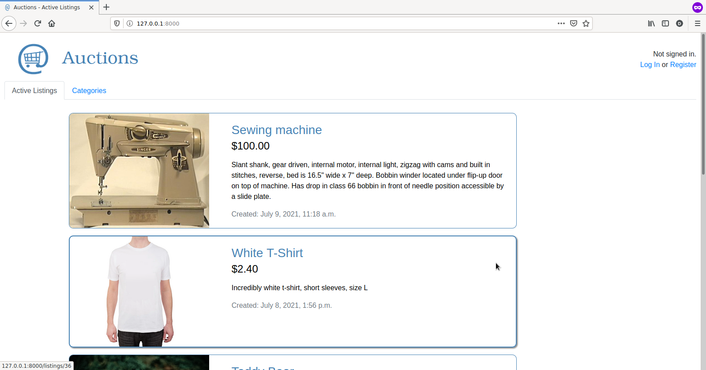

# Commerce

An eBay-like e-commerce auction site that will allow users to post auction listings, place bids on listings, comment on those listings, and add listings to a “watchlist.”

Project built using [Django framework](https://www.djangoproject.com/).

## Install in a virtual environment

    $ git clone https://github.com/daniel-ob/CS50W.git
    $ cd CS50W/2_Commerce/commerce/
    $ python3 -m venv env
    $ source env/bin/activate
    (env)$ pip install -r requirements.txt
    (env)$ python3 manage.py makemigrations auctions
    (env)$ python3 manage.py migrate

## Run 

Start Django server

    $ python3 manage.py runserver

Then open [http://127.0.0.1:8000/](http://127.0.0.1:8000/)
