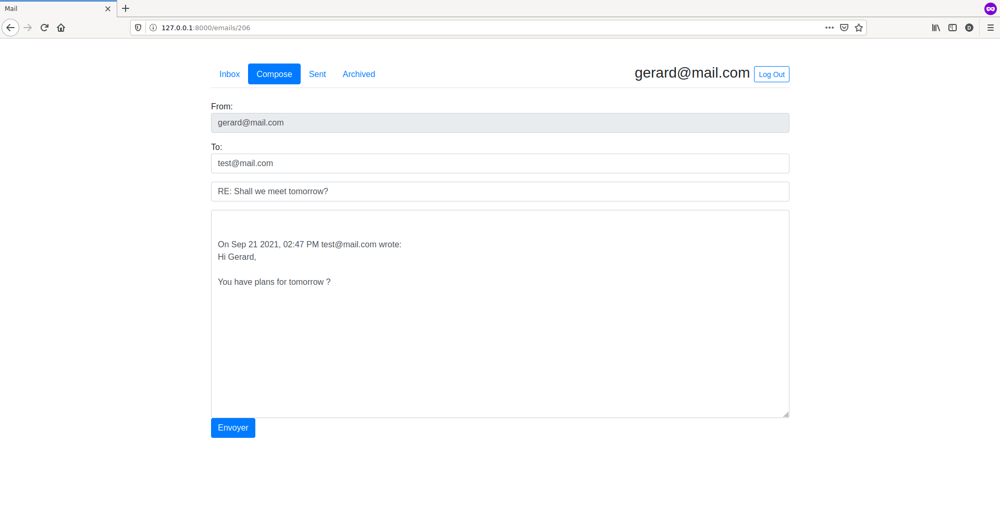

# Mail

A front-end for an email client that makes API calls to send and receive emails, built using **JavaScript, HTML and CSS.**

Project back-end provided on distribution code was built using **Django framework**.

## Functionalities

- Send Mail
- Mailbox:
    - Retrieve and display emails from 3 mailboxes: Inbox, Sent, Archived.
    - Unread emails appears with a white background, read ones with a grey background.
- View Email. Once the email has been clicked, it is marked as read.
- Archive and Unarchive:
    - Inbox emails can be archived.
    - Archived emails can be unarchived.
- Reply: Email composition form fields are pre-filled with original email details.

### Bonus:

- Error display (fetch errors)
- Browser URL history update
- Responsive design using Bootstrap's columns

## Install in a virtual environment

    $ git clone https://github.com/daniel-ob/CS50W.git
    $ cd CS50W/3_Mail/mail/
    $ python3 -m venv env
    $ source env/bin/activate
    (env)$ pip install -r requirements.txt
    (env)$ python3 manage.py makemigrations mail
    (env)$ python3 manage.py migrate

## Run 

Start Django server

    $ python3 manage.py runserver

Then open [http://127.0.0.1:8000/](http://127.0.0.1:8000/)
