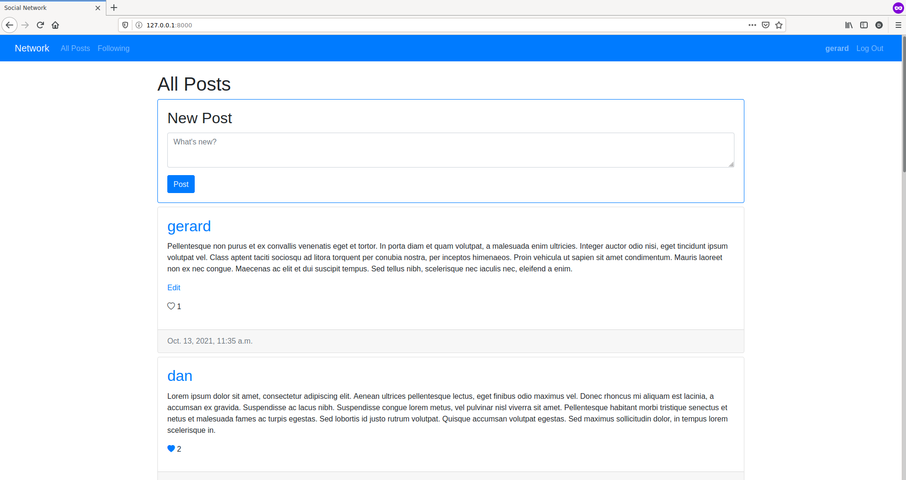

# Network

A Twitter-like social network website for making posts and following users.

Project built with Django, HTML, CSS and JavaScript.

## Features

1. **New post**: signed users can send new posts through a form in "All Posts" page.
2. **All posts page**: shows all posts from all users, with most recent post first.
3. **Profile page**: click on username load that user's profile. That page shows:
   1. Number of followers and number of people the user follows.
   2. All posts from that user, most recent post first.
   3. (for signed users) A button to follow/unfollow that user's posts.
4. **Following page**: (for signed users) shows all posts from users that the current user follows. 
This is made using asynchronous JavaScript, without reloading entire page.
5. **Pagination**: maximum 10 posts per page displaying posts. Posts are split across several pages, with Previous/Next links.
6. **Edit post**: users can edit their own posts. "Edit" link displays a textarea and a "Save" button to update post content. 
Edition can be cancelled using "Cancel" button or "Escape" key. 
This is made using asynchronous JavaScript, without reloading entire page.
7. **Like/Unlike**:
   1. Signed users can *like* any post clicking on a button (asynchronous JavaScript is used). 
   2. A CSS animation is played when user *likes* a post.
   3. Each post displays the number of *likes* it has.
8. **Responsiveness**: the application is mobile-responsive. This has been done using Bootstrap CSS framework.
9. **Tests**:
   1. A series of **unit tests** has been written to ensure that post, edition, like, follow and pagination,
   among others, are working as expected. Unauthenticated user restrictions are also tested. 
   2. A **end-to-end browser test** has also been written using Selenium framework.  
10. **Reverse URLs**: All URLs used in templates, JavaScript code and tests are related to those on `urls.py`, 
so a change on this file doesn't affect the rest of the application.
11. **API**: some actions can be performed via API (see [API](#api-section) section)

## Install in a virtual environment

    $ git clone https://github.com/daniel-ob/CS50W.git
    $ cd CS50W/4_Network/project4/
    $ python3 -m venv env
    $ source env/bin/activate
    (env)$ pip install -r requirements.txt
    (env)$ python3 manage.py makemigrations network
    (env)$ python3 manage.py migrate

## Run 

Start Django server

    (env)$ python3 manage.py runserver

Then open [http://127.0.0.1:8000/](http://127.0.0.1:8000/)

## Tests run

All tests

    (env)$ python3 manage.py test network.tests

##  API

Some actions can be performed via API. 

This **requires authentication.** 

Also, each request must set a `X-CSRFToken` header to the value of `csrftoken` cookie.   

### Follow/Unfollow user

Users can follow **other users**.

`PUT /users/{userId}`

JSON body parameter: 

`follow` (boolean): `true` to *follow* user, `false` to *unfollow* user

**Response**:

If request is successful, response contains (JSON body):
- `message`
- `followerCount`: new follower count for that user

### Update post content

Users can update their **own posts**.

`PUT /posts/{postId}`

JSON body parameter: 

- `content` (string): length between 1 and 512 characters

### Like/Unlike post

`PUT /posts/{postId}`

JSON body parameter:

- `like` (boolean): `true` to *like* the post, `false` to *unlike* the post

**Response**:

If request is successful, response contains (JSON body):
- `message`
- `likesCount`: new likes count for that post
