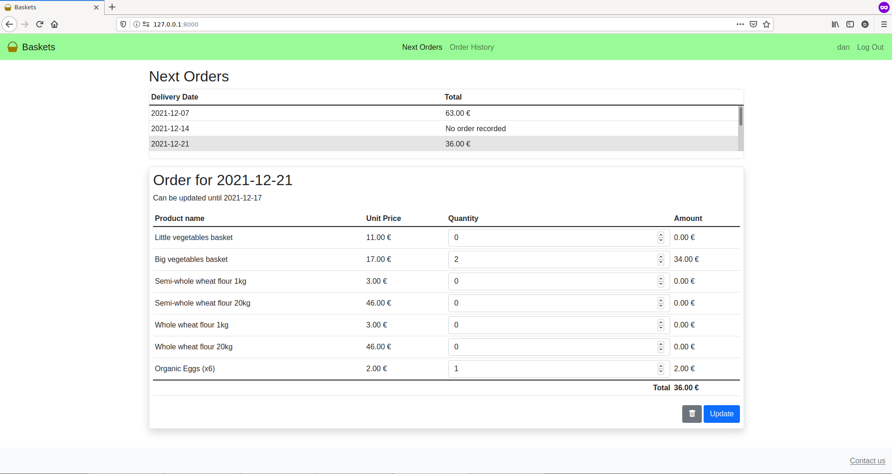
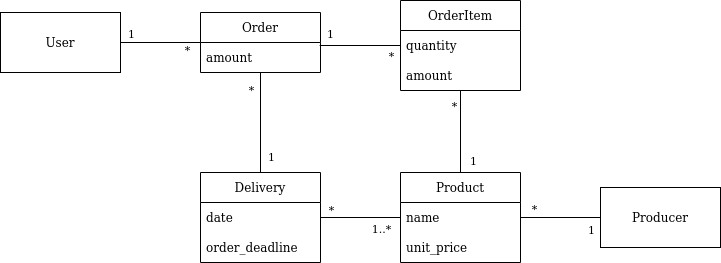

# Baskets

A website to manage orders for local food baskets.

Project built using [Django](https://www.djangoproject.com/), [Bootstrap](https://getbootstrap.com/) and JavaScript.



## Background and goal

This project has been developed to meet a real need for a local association.

The aforementioned association centralises orders for several local food producers.
Thus, food baskets are delivered regularly to users.

Before the deployment of this application, administrators got orders from users via SMS or email.

`Baskets` app aims to save them time by gathering user orders in one unique tool.

Payments will be managed outside this application.

## Distinctiveness and Complexity:

As long as this application will actually go into "production", several meetings were needed to define, show and adjust functionalities. 
This aspect was an additional source of complexity.

A number of new functionalities have been implemented in this project, for instance: 
- Generation of spreadsheet files.
- "Password reset" and "Account validation" flows with email sending.
- A complete API with data validation.

## Features

### User interface

- **Login** page: Not logged users will be redirected to "Login" page. Where they can log-in using their username and password.
- **Register** page: On "Login" page a "Register here" link takes to a page where user can create an account by entering their personal information and choosing a username and password.
  - Passwords are validated to prevent weak passwords.
  - New user's account are "inactive" by default (see "account validation" feature below).
- **Next Orders** page: shows the list of deliveries for which we can still order, in chronological order.
  - Clicking on each delivery opens a frame below showing the date when baskets will be delivered, the last day to order and available products (names and unit prices).
  - User can create one order per delivery.
  - Orders can be updated or deleted until deadline.
- **Order history** page: shows a list of user's closed orders in reverse chronological order. Clicking on each order will open its details below.
- **Password reset**:
  - In "Login" page, a link allows users to request password reset entering an email address. 
  - If an account exists for that email address, a mail is sent with a link to a page to set a new password.
- **Profile** page: clicking on username loads a page where user can view and update its profile information.
- **Contact us** page: a link on footer loads a page to email admins.

All functionalities except "contact" requires authentication.

### Admin interface

Django admin interface has been set up to be able to view, add, edit and delete any User, Producer (and its Products), Delivery and Order.

Also:

- **Users** page allows activating user accounts and set user groups.
- **Deliveries** page allows to:
  - Set each delivery date, order deadline and available products.
    - If "order deadline" is left blank, it will be set to `ORDER_DEADLINE_DAYS_BEFORE` before delivery date.
  - View **total ordered quantity** for each product to notify producers. A link is shown to **modify** related orders items in the event that a maximum stock is reached. 
      - If a user order is changed, a warning message will be shown with user's contact details to notify them.
  - In "Deliveries list" page:
    - View "orders count", which links to related orders.
    - **Export related order forms**: Once a delivery deadline is passed, a link will be shown to download delivery order forms in *xlsx* format. The file will contain one sheet per order including user information and order items.
- **Groups** page allows sending an email to all users in each group via a link. 

### Other

- **Account validation**:
  - For sake of security, an admin validation is needed to activate user accounts.
  - When a new user registers, account is set as "inactive" (user cannot log-in yet) and a notification email is sent to admins.
  - As soon as account is set as 'active', a notification email is sent to user.
- **API**: User orders can be managed using an API. See [API reference](#api-section) for further details.
- **Mobile-responsiveness**: This has been achieved using Bootstrap framework in user interface. Moreover, Django admin interface is also mobile responsive. 

## <a name="domain-model-section"></a> Domain Model



Note that an Order can contain zero OrderItems while it is being created.
In the same way a Producer can also have zero Products.

An additional constraint has been implemented into model: 
- one user can only place one order per delivery.

## Files content overview

`capstone/`
  - `baskets/`
    - `static/`
      - `baskets/`
        - `css/`
          - `orders.css` Styles for `index.html` template
        - `img/`
          - `logo.svg` Application logo used for navbar and favicon
        - `js/`
          - `orders.js` JavaScript code for `index.html` template ("Next Orders" and "Order History" pages).
    - `templates/`
      - `baskets/`
        - `password/`
          - `password_reset.html` template for "Forgotten your password?" page
          - `password_reset_complete.html` template for "Password reset complete" page
          - `password_reset_confirm.html` template for "Set new password" page
          - `password_reset_done.html` template for "Password reset request done" page
        - `contact.html` template for "Contact us" page.
        - `index.html` template for "Next Orders" and "Order history" pages
        - `layout.html` layout template, including navbar and footer, that other app templates will extend   
        - `login.html` template for "Login" page
        - `profile.html` template for "Profile" page
        - `register.html` template for "Register" page
    - `admin.py` set-up for all Django admin pages. Each app **model** has its related Admin class
    - `forms.py` back-end generated forms. Some forms are created from models (ModelForms)
    - `models.py` app **models**: classes specified on [Domain model](#domain-model-section)
    - `tests.py ` app tests: Model tests (`ModelsTestCase` class), API tests (`APITestCase` class) and Webpage tests (`WebPageTestCase` and `EndToEndWebPageTestCase` classes) 
    - `urls.py` app URLS: mapping between **URL paths** and **views** (Python functions on `views.py`). Note that reverse URLs are used in whole project, so in order to change a URL, we must only update this file.
    - `utils.py` "utilities" functions including generation of spreadsheet user forms  
    - `views.py` Python functions that takes web requests and returns web responses. Response can be a web page, a redirection, an HTTP error, a JSON (for API requests) or a file.
  - `capstone/`
    - `settings.py` project settings
    - `urls.py` project urls, includes 'admin' and 'baskets' apps urls.
  - `requirements.txt` python packages required to run the project (see [Dependencies](#dependencies-section)) 

## <a name="dependencies-section"></a> Dependencies

In addition to **Django**, the following libraries has been used:

- **XlsxWriter**: to create xlsx files in `utils.py: get_order_forms_xlsx(delivery)`
- **Selenium**: to do browser end-to-end testing in `tests.py: EndToEndWebPageTestCase.test_end_to_end()`

The versions used can be found in `requirements.txt`

## Install and Configure using a virtual environment

    $ git clone https://github.com/daniel-ob/CS50W.git
    $ cd CS50W/5_Capstone/capstone/
    $ python3 -m venv env

Set the following environment variables at the end of `env/bin/activate` file:

    export SECRET_KEY="django-insecure-(...)"  # set to a unique, unpredictable value
    export ADMIN_EMAIL="admin@email.com"  # additional admins can be set on settings.py 
    
    # SMTP server settings
    export SERVER_EMAIL="server@email.com"
    export EMAIL_HOST="mail.server.com"
    export EMAIL_USE_TLS=true
    export EMAIL_PORT=587  # For starttls
    export EMAIL_HOST_USER="user@email.com"
    export EMAIL_HOST_PASSWORD="password"
    export DEFAULT_FROM_EMAIL="from@email.com"

Or set values directly on `settings.py` file.

Then:

    $ source env/bin/activate
    (env)$ pip install --upgrade pip
    (env)$ pip install -r requirements.txt
    (env)$ python3 manage.py makemigrations baskets
    (env)$ python3 manage.py migrate

Finally, create a superuser:

    (env)$ python3 manage.py createsuperuser

## Run

Start Django server:

    (env)$ python3 manage.py runserver

- User interface: [http://127.0.0.1:8000/](http://127.0.0.1:8000/)
- Admin interface: [http://127.0.0.1:8000/admin](http://127.0.0.1:8000/admin)

## Tests run

All tests:

    (env)$ python3 manage.py test baskets.tests

## <a name="api-section"></a> API Reference

### List open deliveries

List deliveries for which we can still order.

```
get /deliveries
```

**Response**

```
 Status: 200 OK
```
```
[
    {
        "id": 5,
        "date": "2021-11-30"
    },
    {
        "id": 6,
        "date": "2021-12-07"
    }
]
```

### Get delivery details

```
get /deliveries/{delivery_id}
```

**Response**

```
 Status: 200 OK
```
```
{
    "date": "2021-11-30",
    "order_deadline": "2021-11-26",
    "products": [
        {
            "id": 1,
            "name": "Eggs (6 units)",
            "unit_price": "2.00"
        },
        {
            "id": 2,
            "name": "Big vegetables basket",
            "unit_price": "17.00"
        },
        {
            "id": 3,
            "name": "Semi-whole wheat flour 1kg",
            "unit_price": "3.00"
        }
    ],
    "message": "This week meat producer is on vacation",
    "is_open": true
}
```

### List user orders

Requires authentication

```
get /orders
```

**Response**

```
 Status: 200 OK
```
```
[
    {
        "id": 2,
        "delivery_id": 1
    },
    {
        "id": 38,
        "delivery_id": 3
    }
]
```

### Create an order

Requires authentication

**X-CSRFToken** header must be set to the value of **csrftoken** cookie

```
post /orders
```
```
{
    "delivery_id": 5,
    "items": [
        {
            "product_id": 1,
            "quantity": 1
        },
        {
            "product_id": 2,
            "quantity": 2
        }
    ],
    "message": "is it possible to come and pick it up the next day?"
}
```

Request must follow this rules:

- delivery must be opened for orders (delivery.order_deadline >= today)
- a user can only post an order per delivery
- order must contain at least one item
- all item products must be available in delivery.products
- all item quantities must be greater than zero

**Response**
```
Status: 201 Created
```
```
{
    "message": "Order has been successfully created",
    "url": "/orders/48",
    "amount": "36.00"
}
```

### Update an order

Requires authentication.

Orders can be updated while related delivery.order_deadline is not passed.

**X-CSRFToken** header must be set to the value of **csrftoken** cookie.

```
put /orders/{order_id}
```
```
{
    "items": [
        {
            "product_id": 1,
            "quantity": 2
        },
        {
            "product_id": 3,
            "quantity": 1
        }
    ],
    "message": ""
}
```

Updated items must follow this rules:

- all item products must be available in delivery.products
- all item quantities must be greater than zero

**Response**

```
 Status: 200 OK
```
```
{
    "message": "Order has been successfully updated",
    "amount": "7.00"
}
```

### Delete an order

Requires authentication

**X-CSRFToken** header must be set to the value of **csrftoken** cookie.

```
delete /orders/{order_id}
```

**Response**

```
 Status: 200 OK
```
```
{
    "message": "Order has been successfully deleted"
}
```